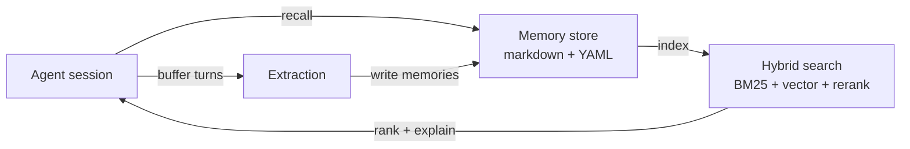

# Remnic

[](https://www.npmjs.com/package/@remnic/cli)
[](LICENSE)
[](https://github.com/sponsors/joshuaswarren)

Open-source, local-first memory and context for AI agents. One memory store, every agent.

Website: **[remnic.ai](https://remnic.ai)** - guide library, comparisons, benchmarks, and changelog.

- **Your files, your machine.** Every memory is a plain markdown file with YAML frontmatter on your disk. No database, no cloud dependency, no subscription. `cat`, `grep`, edit, and version-control your memory with the tools you already use.
- **One memory across every tool.** OpenClaw, Claude Code, Codex CLI, Cursor, ChatGPT (developer mode), Hermes, Replit, Pi, omp, Factory Droid, and any MCP client read and write the same store. Tell one agent a preference; every agent knows it.
- **Automatic extraction and recall.** Remnic watches conversations, distills durable knowledge, and injects the right context back when it is needed.
- **Sharp retrieval.** Hybrid search (BM25 + vector + reranking) over rebuildable indexes, with graph recall, memory-worth scoring, and per-result provenance you can inspect.
- **MIT licensed.** Free, open, and built to be forked.

<!-- BEGIN BUILD FOR GOOD 2026 HIGHLIGHT -->
## Build for Good 2026: What Helps Me

**Explain what helps once. Share only what you choose. Stop sharing at any time.**

What Helps Me is a private support passport built on Remnic. It turns selected
memories into short first-person cards. The owner reviews every word before a
helper can see it.

No OpenAI API key is required. Manual cards need no model. Draft and question
calls use the owner's existing Remnic route, including an OpenClaw gateway or a
local model.

[Watch the narrated 102-second product story](docs/hackathons/assets/what-helps-me/demo.webm)
or read the [full Build for Good entry](docs/hackathons/build-for-good-2026.md).
The walkthrough always shows a **Synthetic replay** banner. It is not live-call
proof. The separate live runner exercises the real standalone server and model
flow. Its receipt validator checks internal consistency, not independent proof.

### What we built

- An owner workspace for selecting exact memories, drafting cards, editing each
  draft, and approving each card.
- Exact-version share links that last from five minutes through seven days.
- A helper view that shows approved cards only and cites the card behind each
  grounded answer.
- Immediate **Stop sharing** controls. Every helper request checks durable grant
  state again.
- A provider-neutral model path. It uses Remnic's existing OpenClaw gateway,
  local, compatible remote, and optional direct OpenAI routes.
- A strict live run record for draft, approval, sharing, question, revocation,
  and the final locked read. It stores no private text, secrets, or raw model IDs.

The framing comes from [NHS England's health and care passport guidance](https://www.england.nhs.uk/long-read/health-and-care-passports-implementation-guidance/).
The NHS guidance says the person owns the passport, chooses its contents, and
chooses who sees it. What Helps Me applies those rules to a broader
self-advocacy tool. It is not a medical record, care plan, IEP, diagnosis tool,
or emergency guide.

### Who it helps

What Helps Me is for people who often need to explain how others can support
them. It also helps trusted helpers act on clear, current guidance without
seeing the person's full memory store.

### How it will be used

1. The owner selects one to 20 notes.
2. The owner checks a clear consent box or writes a card by hand.
3. The configured model drafts up to eight cards.
4. The owner edits and approves each card.
5. The owner shares exact card versions for a set time.
6. The helper reads the guide or asks a grounded question.
7. The owner selects **Stop sharing** to lock the link.

The model is the scribe. The person is the author.

### How Codex helped

Codex traced Remnic's existing memory, model, HTTP, MCP, and browser contracts.
It then built the feature as a seven-layer PR stack. Codex also wrote adversarial
tests, checked WCAG states at four widths, and built the privacy-safe live run
record. The owner approval and revocation rules remain deterministic core
code. A model cannot bypass them.

### How to run the project

Run the no-key synthetic walkthrough in about five minutes:

```bash
git clone https://github.com/joshuaswarren/remnic.git
cd remnic
pnpm install --frozen-lockfile
pnpm exec playwright install chromium
npm run demo:support-passport:replay
```

Open the printed loopback URL. The replay uses synthetic data and labels itself
on every screen.

Run the standalone live flow with a local, direct, or compatible model route:

```bash
npm run demo:support-passport:live -- \
  --config ./remnic.config.json \
  --output ./tmp/support-passport-demo
npm run demo:support-passport:validate-receipt -- \
  --receipt ./tmp/support-passport-demo/receipt.json
```

The validator checks the self-reported receipt schema and hash consistency. It
does not convert that receipt into independent attestation.

For an existing OpenClaw install, keep the current gateway providers and model
auth. Enable the feature, owner HTTP bridge, and gateway route in
`openclaw.json`:

```jsonc
{
  "plugins": {
    "entries": {
      "openclaw-remnic": {
        "config": {
          "modelSource": "gateway",
          "openaiApiKey": false,
          "supportPassport": { "enabled": true },
          "agentAccessHttp": {
            "enabled": true,
            "host": "127.0.0.1",
            "port": 4318,
            "authToken": "${OPENCLAW_REMNIC_ACCESS_TOKEN}",
            "principal": "passport-owner"
          }
        }
      }
    }
  }
}
```

Set `OPENCLAW_REMNIC_ACCESS_TOKEN` to a private local bearer token. This token
protects the browser bridge. It is not a model provider key. Open
`/remnic/ui/what-helps-me/` on the configured Remnic HTTP origin. Remnic uses
the OpenClaw gateway model chain and its existing provider auth.

The standalone live runner does not boot an OpenClaw host. Use the real browser
flow above to exercise an existing OpenClaw gateway setup. No OpenAI API key is
required. Manual cards and sharing need no model. Draft and question requests
return `503 provider_unavailable` when no model route is configured.
<!-- END BUILD FOR GOOD 2026 HIGHLIGHT -->

<!-- BEGIN OPENAI BUILD WEEK 2026 HIGHLIGHT — temporary submission section -->
## OpenAI Build Week 2026: Remnic Relay

**Correct once. Every agent learns.**

Remnic is shared memory for AI agents. **Remnic Relay** is the human-governed
correction loop we built for OpenAI Build Week: it exposes the stale belief
behind an agent failure, shows where that belief came from, puts the proposed
replacement behind human approval, and proves a brand-new agent learned the
approved correction from Remnic.

The demonstration follows an online-payment failure. One Codex agent reads the
current rule while another confidently applies an older retry rule. Relay opens
an evidence X-Ray connecting the recalled memory to the failing test, presents
a before-and-after memory diff for approval, preserves the old belief as
superseded, and then starts a fresh agent with no handoff. The mission is only
complete when that agent recalls the replacement and turns the same payment
test green.

### What we built during Build Week

- a versioned contract for conflicts, evidence, corrections, lineage, and
  fresh-agent verification;
- a human-gated correction engine with append-only supersession;
- Mission Control views for conflict inspection, evidence X-Ray, approval,
  propagation, and the final mission receipt;
- an isolated four-role Codex mission runner using only a cleared synthetic
  Remnic instance; and
- a dependency-free judge package that binds the recorded agent run, product
  UI, synthetic fixture, and verification receipt into one reproducible story.

### How Codex and GPT-5.6 were used

Codex collaborated across the new extension: contract modeling, correction
engine, Mission Control, isolated runner, adversarial tests, evidence sealing,
and judge packaging. GPT-5.6 also powers the demonstrated product workflow
itself through four isolated Codex roles: Scout reads the accepted rule, a
Builder acts on stale memory, a correction agent proposes the replacement, and
a fresh Builder proves the approved memory propagated without an agent
handoff. Agents propose; a human approves; the test proves the result.

### Install, supported platforms, and testing

The fastest judge path uses the committed synthetic mission and requires no
dependency install, model call, account, or credential:

```bash
git clone https://github.com/joshuaswarren/remnic.git
cd remnic
node scripts/relay/judge-package.mjs serve
```

Open the printed loopback URL, compare the current and stale beliefs, open the
X-Ray, review and approve the proposed correction, and follow the fresh agent
through the passing payment test. Verify the same evidence from the terminal:

```bash
node scripts/relay/judge-package.mjs verify
node scripts/verify-relay-judge-package.mjs
```

- **Judge package:** Linux with procfs and Node.js 22.12 or newer; Linux x64 is
  independently clean-room verified.
- **Mission Control:** Chrome/Chromium 151 verified at desktop and mobile
  sizes, including keyboard-only and reduced-motion flows.
- **Live isolated mission runner:** Linux x64 with Codex CLI 0.144.4 or newer
  and the repository development dependencies. This is not required for the
  judge experience.
- **macOS and Windows:** use the submission video/gallery or run the verifier
  in a supported Linux environment. The executable verifier fails closed where
  equivalent filesystem-safety primitives are unavailable.

Remnic's core memory engine, integrations, and benchmark framework predate
Build Week. The [submission ledger](HACKATHON.md) separates that foundation
from the new Relay work. See the [judge guide](docs/remnic-relay/JUDGE-GUIDE.md)
and [claim ledger](docs/remnic-relay/CLAIMS.md) for the complete evidence.
<!-- END OPENAI BUILD WEEK 2026 HIGHLIGHT -->

## Why Remnic

Most agents do not fail because they lack another prompt. They fail because they do not understand the user, the project, the boundaries, or what "good" means in context. Every session starts from zero: the agent forgets your name, your projects, the decisions you already made, and the bugs you already debugged. You re-explain the same context over and over, and the agent still repeats the same mistakes.

There is a useful split in AI memory between **memory backends** (extract facts, store vectors, retrieve relevant ones) and **context substrates** (human-readable context that accumulates and compounds across sessions). Most tools pick one camp. Remnic does both:

- **The files are the source of truth.** The hybrid search index is downstream of your markdown, fully rebuildable from disk, never authoritative itself.
- **Recall stays sharp.** Three retrieval tiers, opt-in graph traversal, memory-worth scoring that filters low-value facts before they reach the model, and temporal supersession that keeps stale facts out.
- **It compounds.** Background consolidation merges duplicates, promotes recurring themes, and snapshots page versions on every overwrite. The longer you use it, the better it gets, and you can always read exactly what it knows.

| Without Remnic | With Remnic |
|---|---|
| Re-explain who you are and what you are working on | The agent recalls your identity, projects, and preferences automatically |
| Repeat context for every task | Entity knowledge surfaces people, projects, tools, and relationships on demand |
| Lose debugging and research context between sessions | Past root causes, dead ends, and findings are recalled, so work is not repeated |
| Manually restate preferences every session | Preferences persist across sessions, agents, and projects |
| A context-switching tax when you resume work | Session-start recall brings you back up to speed |
| Built-in agent memory that does not scale | Hybrid search, lifecycle management, namespaces, and governance |
| Third-party memory services that cost money and hold your data | Everything stays local: your filesystem, your rules |


## How Remnic compares

Most alternatives trade away at least one of local-first storage, a free license, or multi-host support; Remnic combines all three in one package.

| Option | Hosting | Price | Agent coverage | Storage |
|---|---|---|---|---|
| Remnic | Local-first | Free (MIT) | Native plugins for Claude Code, Codex CLI, Pi, OpenClaw, Hermes, plus any MCP client | Markdown + YAML, rebuildable index |
| mem0 | Cloud / self-host | Freemium | SDK / API | Vectors / database |
| Letta (MemGPT) | Cloud / self-host | Freemium | API | Database-backed |
| Zep (Graphiti) | Cloud / self-host | Freemium | SDK / API | Graph database |
| Supermemory | Cloud | Paid | API | Hosting handled by the service |
| MemPalace | Local | Free | Single host | Local |
| ChatGPT memory | Cloud | Bundled | Single tool | Opaque |

Hosting and price labels mirror the canonical matrix at [remnic.ai/compare](https://remnic.ai/compare), which also carries the per-competitor teardowns. Importers for mem0, Supermemory, ChatGPT, Claude, and Gemini: [remnic.ai/import](https://remnic.ai/import).

## Quick start

### Prerequisites

- [Node.js](https://nodejs.org/) 22.12 or newer.
- A model provider for extraction (an OpenAI API key, the OpenClaw gateway model chain, or a [local LLM](docs/guides/local-llm.md)). Retrieval-only mode needs none of these.
- Optional but recommended: [QMD](https://github.com/tobi/qmd) for the highest-quality hybrid search. Without it, Remnic falls back to embedding search and then recency-ordered reads.

### Any agent (standalone)

Install the CLI, start the daemon, and verify it is running.

```bash
npm install -g @remnic/cli       # installs `remnic` (plus the legacy `engram` forwarder)
remnic init                      # write remnic.config.json
export OPENAI_API_KEY=sk-...     # extraction provider (or route to a local LLM)
export REMNIC_AUTH_TOKEN=$(openssl rand -hex 32)
remnic daemon start              # start the background server
remnic status                    # confirm it is running
remnic query "hello" --explain   # test a query with the tier breakdown
```

`remnic query --explain` prints which retrieval tier produced each result and why, so you can watch the memory pipeline work on your very first query. Run `remnic doctor` any time to check your setup, then connect a tool from the table below. Full five-minute walkthrough: [docs/guides/quickstart.md](docs/guides/quickstart.md).

### OpenClaw (native plugin)

OpenClaw gets the deepest integration: a memory-slot plugin that recalls every session and observes every response.

```bash
openclaw plugins install clawhub:@remnic/plugin-openclaw   # install the plugin
remnic openclaw install                                    # wire the memory slot in openclaw.json
launchctl kickstart -k gui/$(id -u)/ai.openclaw.gateway    # restart the OpenClaw gateway (macOS)
remnic doctor                                              # verify every check passes
```

`remnic openclaw install` writes `plugins.entries["openclaw-remnic"]` and sets `plugins.slots.memory = "openclaw-remnic"` in `~/.openclaw/openclaw.json`. Without the slot, OpenClaw skips plugin registration and no hooks fire, so `remnic doctor` checks the slot explicitly and points you at the fix. After the restart, confirm the plugin is live:

```bash
grep "gateway_start fired" ~/.openclaw/logs/gateway.log
```

A matching line means Remnic is active and hooks are firing. (The `[engram]` log prefix remains during the v1.x compatibility window.)

Prefer to let the agent do it? Tell any OpenClaw agent: *"Install the @remnic/plugin-openclaw plugin and configure it as my memory system."* It runs the install, updates `openclaw.json`, and restarts the gateway for you. Comprehensive install and first-run guide, including QMD setup: [docs/getting-started.md](docs/getting-started.md).

## Works with your tools

One store, many front doors. Each integration reads and writes the same memory on your machine, so a preference you state in one tool is available in all of them.

| Tool | Integration | Recall / observe | Docs |
|------|-------------|------------------|------|
| OpenClaw | Native memory-slot plugin | Every session / every response | [docs/plugins/openclaw.md](docs/plugins/openclaw.md) |
| Claude Code | Native hooks + MCP | Every prompt / every tool use | [docs/plugins/claude-code.md](docs/plugins/claude-code.md) |
| Codex CLI | Native hooks + MCP + memory extension | Every prompt / every tool use | [docs/plugins/codex.md](docs/plugins/codex.md) |
| ChatGPT (developer mode) | MCP + OAuth 2.1 on your own server | On demand | [docs/integration/chatgpt.md](docs/integration/chatgpt.md) |
| Cursor | Generic MCP client | On demand | [docs/integration/connector-setup.md](docs/integration/connector-setup.md) |
| Hermes | Python `MemoryProvider` | Every LLM call / every turn | [docs/plugins/hermes.md](docs/plugins/hermes.md) |
| Replit | MCP | On demand | [docs/plugins/replit.md](docs/plugins/replit.md) |
| Pi Coding Agent | Native extension + MCP + compaction | Every turn / every turn | [docs/integration/pi.md](docs/integration/pi.md) |
| Oh My Pi (omp) | Native extension + MCP | Every turn / every turn | [docs/integration/omp.md](docs/integration/omp.md) |
| Factory Droid | HTTP MCP + bearer auth | On demand | [docs/integration/droid.md](docs/integration/droid.md) |
| Any MCP client | HTTP or stdio MCP | On demand | [docs/integration/connector-setup.md](docs/integration/connector-setup.md) |

Once the daemon is running, register each tool with a single command:

```bash
remnic connectors install codex-cli     # token + connector state + memory extension
remnic connectors install claude-code   # token + connector state
remnic connectors install pi            # token + connector state
remnic connectors install omp           # token + connector state
remnic connectors install replit        # token + connector state
remnic connectors install droid         # token + connector state + ~/.factory/mcp.json
```

Each install mints a host-specific auth token and records Remnic-side connector state; for some hosts (such as Codex CLI) it also materializes the memory extension. How much of the host itself gets configured varies — Claude Code and Hermes, for example, need a few manual wiring steps documented in their plugin guides. See the [connector setup guide](docs/integration/connector-setup.md) for every tool, exactly what its install automates, its config snippet, and multi-tenant setups.

Over MCP, Remnic exposes a rich tool surface beyond store and recall: entity lookup, memory correction, temporal recall, X-ray provenance, daily briefing, work-board, and continuity tools among them. Hosted clients call these directly, and the standalone HTTP endpoint (`remnic daemon start` or `@remnic/server`) serves the same tools. See the [HTTP + MCP API reference](docs/api.md).

## How it works

Remnic runs a continuous three-phase loop around every agent conversation:

```
  Recall   ->  Before a conversation, inject the relevant memories into context
  Buffer   ->  After each turn, accumulate content until a trigger fires
  Extract  ->  Periodically, distill structured memories with an LLM and write them to disk
```

- **Recall** ranks your stored memories against the incoming context and injects a budgeted slice back into the prompt. Extraction and rerank can run through the OpenClaw gateway model chain, OpenAI (Responses API), or a local LLM. See [docs/guides/cost-control.md](docs/guides/cost-control.md).
- **Buffer** accumulates conversation turns until a size or time trigger fires, so extraction runs on meaningful spans rather than on every message.
- **Extract** distills durable knowledge, runs it through an importance judge, and writes accepted memories to disk. The search index is then rebuilt from those files.



Each memory is a portable markdown file with YAML frontmatter, so it stays git-friendly and readable with no database required:

```yaml
---
id: decision-1738789200000-a1b2
category: decision
confidence: 0.92
tags: ["architecture", "search"]
---
Use the port/adapter pattern for search backends so alternative engines
can replace the default index without changing core logic.
```

Categories include `fact`, `decision`, `preference`, `correction`, `relationship`, `principle`, `commitment`, `skill`, and `rule`. Files are organized on disk under your configured memory directory:

```
<memoryDir>/
  facts/       extracted facts, decisions, preferences, corrections, ...
  entities/    people, projects, tools, and their relationships
  profile.md   the accumulated user profile
```

The search index lives separately and is rebuildable from these files at any time. The full storage model and retrieval flow are in [docs/architecture/overview.md](docs/architecture/overview.md).

## Feature highlights

**Core memory.** LLM extraction that separates durable knowledge from conversational noise, entity tracking for people, projects, tools, and relationships, a full write/consolidate/expire lifecycle, and importance gating that drops low-value facts before they are ever stored. See [docs/architecture/memory-lifecycle.md](docs/architecture/memory-lifecycle.md).

**Search.** Six pluggable backends behind one interface: QMD, [Orama](https://oramasearch.com/), LanceDB, Meilisearch, a remote adapter, and a no-op. QMD is the default and highest-quality option, combining BM25, vector, and reranking. Any backend is rebuildable from your markdown at any time. See [docs/search-backends.md](docs/search-backends.md).

**Memory OS.** [Namespaces](docs/namespaces.md) for multi-agent and multi-tenant isolation (opt-in via `namespacesEnabled`, default `false`), hot/cold [tiering](docs/retention-policy.md) driven by a value-score model, background consolidation via the ["dreams" surface](docs/dreams.md), opt-in [graph reasoning](docs/architecture/graph-reasoning.md) with Personalized PageRank, and transparent AES-256-GCM [at-rest encryption](docs/encryption.md) (opt-in via `secureStoreEnabled`, default `false`).

**Lossless Context Management.** Archive full session transcripts and recall them losslessly through the daemon recall envelope, for when a summary is not enough. Opt-in via `lcmEnabled`, default `false`. See [docs/guides/lossless-context-management.md](docs/guides/lossless-context-management.md).

**Trust and boundaries.** Scoped memory, provenance on every fact, correction handling, and boundary principles that decide when an agent should ask instead of act. See [docs/user-aware-agents.md](docs/user-aware-agents.md).

**Import your memory.** Seven optional importers pull existing memory from the tools you already use. The base CLI never bundles them; install only what you need, and every run supports `--dry-run` for a zero-write preview.

| Source | Package | Adapter |
|--------|---------|---------|
| ChatGPT | `@remnic/import-chatgpt` | `remnic import --adapter chatgpt` |
| Claude | `@remnic/import-claude` | `remnic import --adapter claude` |
| Gemini | `@remnic/import-gemini` | `remnic import --adapter gemini` |
| mem0 | `@remnic/import-mem0` | `remnic import --adapter mem0` |
| Supermemory | `@remnic/import-supermemory` | `remnic import --adapter supermemory` |
| WeClone | `@remnic/import-weclone` | `openclaw engram bulk-import --source weclone` |
| lossless-claw | `@remnic/import-lossless-claw` | `remnic import-lossless-claw` |

See [docs/importers.md](docs/importers.md) for input formats, provenance metadata, and the full privacy breakdown.

**Open Knowledge Format (OKF).** The memory directory doubles as an OKF v0.1 knowledge bundle: every memory file ships an inert `type` field next to Remnic's canonical `category`, so OKF-aware consumers can read your store without a converter. `category` stays authoritative — `type` is interop metadata and never overrides it on parse. Two commands keep the bundle conformant:

| Command | What it does |
|---------|--------------|
| `remnic okf lint` | Report files missing frontmatter or `type`; exit 1 when findings remain (`--json` for machine output) |
| `remnic okf sweep` | Backfill missing `type` values from `category` without bumping `updated` (opt-in via `okf.sweepEnabled`) |

Config gates, lint finding codes, and the full category-to-type mapping: [docs/okf.md](docs/okf.md).

**Live connectors: Google Drive and Notion.** Beyond one-time imports, Remnic can *continuously* sync external sources into memory. The Google Drive and Notion connectors poll for changed documents on a schedule and ingest them incrementally — connect once (`remnic connectors run google-drive` / `remnic connectors run notion` for a manual sync, `remnic connectors status` to inspect), and your docs stay searchable alongside everything else your agents know. Gmail and GitHub connectors run on the hosted scheduler as well. Setup, OAuth, and polling details: [docs/live-connectors.md](docs/live-connectors.md).

**Wearables.** Three optional connectors ingest AI-wearable recordings, clean and speaker-label the transcripts, apply your personal corrections, store searchable per-day transcript files, and create memories under strict per-source trust gates: `@remnic/connector-limitless` (Limitless Pendant), `@remnic/connector-bee` (Bee bracelet), and `@remnic/connector-omi` (Omi necklace). See [docs/wearables.md](docs/wearables.md).

**Glass-box tooling.** [Recall X-ray](docs/xray.md) shows which retrieval tier produced each result and why, the [daily briefing](docs/guides/daily-briefing.md) surfaces active entities and open commitments, and the [operator console](docs/console.md) gives live engine introspection with trace record and replay.

**Benchmarks.** Memory quality is measured, not asserted. [MemCorrect](docs/benchmarks/memcorrect.md) checks whether a backend recalls the right fact, accepts a correction, and stops serving the stale one. The [full benchmark suite](docs/benchmarks.md) covers the rest, with reproducible artifacts and leaderboard safety.

**More capabilities.** A few of the deeper features, each with its own guide:

- [Procedural memory](docs/procedural-memory.md) — multi-step runbooks captured from your work (on by default outside the `conservative` preset).
- [Temporal recall](docs/temporal-recall.md) — `valid_at` / `invalid_at` fact lifecycle and an `as_of` recall filter.
- [Pattern reinforcement](docs/pattern-reinforcement.md) — cross-session pattern detection with a recall boost for reinforced primitives.
- [Shared context](docs/shared-context.md) — cross-agent shared intelligence for multi-agent teams.
- [Coding-agent memory](docs/coding-agent.md) — repo conventions, review behavior, and ask-before rules for coding tools.

## Privacy and your data

Local-first is a trust feature, not a tagline.

- **Everything lives on your disk** as markdown you can inspect, edit, back up, and version-control. There is no Remnic cloud and no account.
- **Retrieval never needs the network.** Recall runs entirely against your local files and index.
- **Extraction uses the provider you choose.** When Remnic distills a memory, it calls whatever model provider you configured. To keep every byte on-device, route extraction to a [local LLM](docs/guides/local-llm.md) or use `--dry-run` on imports to preview without writing.
- **Sensitive tools see what you surface.** When a hosted client such as ChatGPT calls Remnic's tools, the content it reads and writes also passes through that client's pipeline. Treat what you expose accordingly.
- **Keep user data out of git.** Paths that contain memory content (`facts/`, `entities/`, `profile.md`) should never be committed. Enable [at-rest encryption](docs/encryption.md) if the disk itself is untrusted.

## Architecture

Remnic is a [pnpm](https://pnpm.io/) monorepo of **25+ published packages**. The engine is host-agnostic; every integration is a thin adapter over it, so standalone Remnic is always first-class and adapter work follows each host's upstream SDK rather than recreating host behavior inside Remnic.

```text
                        @remnic/core
             (extraction, storage, search,
              graph, trust, consolidation)
                            |
        +-------------------+-------------------+
        |                   |                   |
   @remnic/cli        @remnic/server       plugins
   (remnic bin)       (HTTP + MCP)      openclaw, claude-code,
                                        codex, pi, hermes
                            |
                     a la carte add-ons
              import-* (7 importers) + connector-*
                    (3 wearable sources)
```

- **Engine:** `@remnic/core` (the framework-agnostic memory engine), `@remnic/cli` (the standalone `remnic` binary), and `@remnic/server` (HTTP + MCP server).
- **Plugins:** native adapters for OpenClaw, Claude Code, Codex, and Pi, plus Hermes shipped as `remnic-hermes` on PyPI.
- **A la carte:** seven `@remnic/import-*` importers and three `@remnic/connector-*` wearable connectors, installed only when you need them.
- **Benchmarks:** `@remnic/bench` provides the published suites and CI regression gates.

The complete package map, dependency graph, and publish order are in [docs/architecture/monorepo-structure.md](docs/architecture/monorepo-structure.md).

## Configuration

Remnic is zero-config by default: `remnic init` writes a working `remnic.config.json` and every subsystem ships a sensible default. When you need control, there are hundreds of options grouped under four presets, selectable with a single `memoryOsPreset` key:

- `conservative` — minimal footprint, extraction judge and heavier features off.
- `balanced` — the general-purpose default.
- `research-max` — every quality feature enabled, highest cost.
- `local-llm-heavy` — tuned for local-model extraction and rerank.

Extraction routing (`gateway`, OpenAI, or a local LLM), recall budget, search backend, lifecycle, namespaces, and encryption are all configurable. Every setting, its default, and operator guidance live in [docs/config-reference.md](docs/config-reference.md).

## Self-hosting and operators

Running Remnic for a team or across machines? `remnic daemon start` hands off to launchd or systemd when a service is installed, and `@remnic/server` exposes the same memory over HTTP + MCP for remote agents. Namespaces isolate tenants, and the standalone server supports multi-tenant, multi-harness setups.

- [Standalone server guide](docs/guides/standalone-server.md) — multi-tenant setup and connecting multiple harnesses.
- [Deployment topologies](docs/integration/deployment-topologies.md) — localhost, LAN, remote, and containerized layouts.
- [Operations](docs/operations.md) — backups, exports, hourly summaries, and logs.

## Documentation

The complete, organized docs hub lives at **[docs/README.md](docs/README.md)**. Starting points by journey:

- **Start here:** [Quickstart](docs/guides/quickstart.md) - [Getting started](docs/getting-started.md) - [CLI reference](docs/cli.md)
- **Connect your tools:** [Connector setup](docs/integration/connector-setup.md) - [ChatGPT](docs/integration/chatgpt.md) - [Plugins index](docs/plugins/README.md) - [Deployment topologies](docs/integration/deployment-topologies.md)
- **Configure:** [Config reference](docs/config-reference.md) - [Search backends](docs/search-backends.md) - [Local LLM](docs/guides/local-llm.md) - [Cost control](docs/guides/cost-control.md)
- **Operate:** [Operations](docs/operations.md) - [Retention policy](docs/retention-policy.md) - [Import / export](docs/import-export.md) - [Standalone server](docs/guides/standalone-server.md)
- **Internals:** [Architecture overview](docs/architecture/overview.md) - [Retrieval pipeline](docs/architecture/retrieval-pipeline.md) - [Memory lifecycle](docs/architecture/memory-lifecycle.md) - [HTTP + MCP API](docs/api.md)

The website publishes the [guide library](https://remnic.ai/guides) (what is AI agent memory, MCP memory servers, Claude Code memory), the [comparison pages](https://remnic.ai/compare), the [benchmarks report](https://remnic.ai/benchmarks), and the [changelog](https://remnic.ai/changelog).

## FAQ

**Do I need OpenClaw?** No. Remnic runs standalone through `@remnic/cli` and connects to any tool over MCP or HTTP. OpenClaw simply gets the deepest native integration.

**Does it work offline or without an API key?** Retrieval works with no provider at all. Extraction needs a model, but you can route it to a [local LLM](docs/guides/local-llm.md) to keep everything on-device.

**Where is my data?** In markdown files under your configured memory directory. Nothing leaves your machine except during extraction with a remote provider, or when a hosted client reads memories through Remnic's tools.

**How much does it cost?** The software is MIT and free. Your only cost is your chosen extraction provider, which is zero when you use a local LLM.

**Do I need QMD?** No, but it gives the best search. Without it, Remnic falls back to embedding search and then recency-ordered reads.

**Can multiple agents share one memory?** Yes. Every connected tool reads and writes the same store, and [namespaces](docs/namespaces.md) isolate tenants when you want separation.

**Is it production-ready?** Remnic is extensively tested with CI regression gates and a published benchmark suite. See [docs/benchmarks.md](docs/benchmarks.md) for the evidence.

**I was using Engram.** Everything still works. See [Engram to Remnic](#engram-to-remnic) below for the migration path.

## Engram to Remnic

Engram is now Remnic. Canonical packages live under the `@remnic/*` scope, and OpenClaw installs use [`@remnic/plugin-openclaw`](https://www.npmjs.com/package/@remnic/plugin-openclaw). The legacy `engram` CLI name, the `openclaw engram` command namespace, and the `/engram/v1/...` HTTP paths remain available as a compatibility surface during the rename window. Migrating an existing install? Run `remnic openclaw migrate-engram --yes`, which backs up the legacy extension, installs the new plugin, preserves your `memoryDir`, and switches the memory slot. Full steps: [Engram to Remnic migration guide](docs/guides/openclaw-engram-to-remnic.md).

## Community and roadmap

- [Feature roadmap (GitHub Project)](https://github.com/users/joshuaswarren/projects/1) — current priority order, blockers, and next work.
- [Issues](https://github.com/joshuaswarren/remnic/issues) — report a bug or request a feature.
- [Contributing](CONTRIBUTING.md) — how to build Remnic and open a pull request.

## Support

Every bit of support helps keep Remnic alive and free. If you are able, [sponsor on GitHub](https://github.com/sponsors/joshuaswarren) or send a Lightning donation to `joshuaswarren@strike.me` to directly fund continued development and new integrations.

[](https://github.com/sponsors/joshuaswarren)

If financial support is not an option, you can still make a big difference: [star the repo](https://github.com/joshuaswarren/remnic), share it, or recommend it to a colleague. Word of mouth is how most people find Remnic.

## Contributing

Contributions from humans and AI-assisted contributors are welcome. Start with [CONTRIBUTING.md](CONTRIBUTING.md) for setup, the preflight gate, and PR expectations. Deeper references: [docs/development/contributing.md](docs/development/contributing.md) and [docs/CONVENTIONS.md](docs/CONVENTIONS.md).

## License

[MIT](LICENSE)
