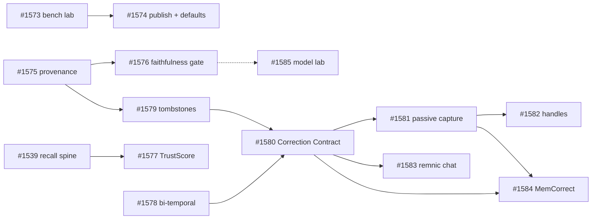

# Glass-Box Memory: SOTA Review and Improvement Plan

Date: 2026-07-03
Status: accepted (umbrella epic [#1572](https://github.com/joshuaswarren/remnic/issues/1572))
Author: repo owner + agent review session

This plan is the written form of a full review of Remnic (codebase, all open
issues, docs) against the mid-2026 state of the art in agent memory —
commercial, open-source, and research. It defines the program tracked by
issues #1572–#1585.

## 1. Where Remnic stands

### Assets (verified in-tree)

- **Multi-host, full-featureset**: OpenClaw, Claude Code, Codex, Pi, Hermes
  adapters plus MCP/HTTP/CLI. The Pi extension is the most-downloaded memory
  extension on that marketplace (#1492). Nobody else ships automatic
  recall + observe + compaction across five hosts.
- **Local-first, file-first**: markdown is authoritative; catalogs and
  indexes are rebuildable.
- **Lifecycle depth**: temporal supersession, nightly contradiction scan with
  LLM judge and review-queue resolution verbs
  (`docs/contradiction-review.md`), dreams, pattern reinforcement,
  governance, page versioning.
- **Outcome/feedback plumbing**: Memory Worth Laplace-smoothed outcome
  counters with recency decay (`memory-worth.ts`), relevance feedback,
  belief-ledger claims/predictions with per-domain calibration.
- **Explainability plumbing**: recall x-ray, tier explain, graph explain,
  recall audit, admin console with recall debugger.
- **Eval harness**: `@remnic/bench` registry covers nine published
  benchmarks (LoCoMo, LongMemEval, BEAM, PersonaMem-v2, MemoryAgentBench,
  MemBench, AMA-Bench, MemoryArena, AMemGym) with reproducible
  `BenchmarkArtifact v1` manifests.

### Gaps (the honest list)

1. **No published benchmark numbers.** `docs/benchmarks.md` says the results
   directory holds mock placeholders. The harness exists; the numbers do not.
2. **Accuracy machinery fragmented and off by default.** Contradiction scan
   defaults off; the Memory Worth recall multiplier was never flipped on
   (`types.ts` ~L814); four recall pipelines with divergent policies (#1539).
3. **Correction is six fragmented surfaces, no product.** Review verbs,
   feedback, outcomes, promote, supersession, belief-ledger challenges — no
   single place a human says "that's wrong" in plain language.
4. **Multi-user scope inconsistency** (#1494 epic, #1492): hot path
   project-scoped, cold path blind to project namespaces.
5. **Surface sprawl**: 70+ MCP tools (doubled by legacy aliases — #1550),
   ~19.9k-LOC orchestrator, config flag sprawl (#1523/#1566).

## 2. The landscape (mid-2026)

### User pain, ranked by evidence

1. **Stale-fact recall / "context rot"** — the failure mode is "remembers a
   stale fact", not "forgot". OpenAI's Dreaming V3 rewrite admitted
   time-sensitive accuracy was 9.4% under its prior memory system (→75.1%).
2. **No audit trail / no control → trust collapse** — Dreaming V3 *reduced*
   the audit trail; users disable memory entirely.
3. **Cross-tool fragmentation** — every tool its own silo.
4. **Memory without world-state** — "technically accurate but practically
   useless" decisions recalled without the context they were made in.
5. **Corrections are buried** — settings-page memory lists at best; no
   conversational correction loop anywhere in the market.

### Scoreboard

- **Mem0**: $24.5M, ~48–51k stars, AWS Agent SDK exclusive, 91.6 LoCoMo
  (April 2026 algorithm), OpenMemory MCP for cross-tool local memory.
- **Zep/Graphiti**: bi-temporal knowledge graph, +18.5% LongMemEval.
- **Letta**: $10M, agent-as-memory runtime.
- **Cognee**: $7.5M, 12k+ stars, graph+vector, `remember/recall/forget/improve`.
- **OpenAI Dreaming V3** (June 2026): background async consolidation that
  rewrites memories as facts change — validates Remnic's dreams/consolidation
  architecture, but opaque and uncorrectable.
- **Research**: A-Mem, HippoRAG-2, LiCoMemory, ENGRAM-R (token efficiency),
  Memory-R1 (RL memory ops), SSGM (memory governance), memorywire (wire
  format). Benchmark headroom is in multi-session + temporal reasoning;
  knowledge-update categories are near ceiling. ICLR 2026 has a dedicated
  MemAgents workshop.

### Strategic read

The field converged on extraction → vector/graph → rerank and now
differentiates on temporal correctness, token efficiency, and trust. Three
things nobody ships well: a **correction loop as a product**, **glass-box
memory** (auditable provenance + calibrated trust), and a **benchmark for
correction/steerability**. Remnic owns most of the raw parts for all three.

**Thesis:** the first memory system that is benchmarked in public on
reproducible hardware, explains every fact it injects, and fixes itself when
you tell it it is wrong — from any agent you use.

## 3. Program structure (issues)

Umbrella: [#1572](https://github.com/joshuaswarren/remnic/issues/1572).

### W0 — Prove it (benchmark lab)

| Issue | Deliverable |
|---|---|
| [#1573](https://github.com/joshuaswarren/remnic/issues/1573) | RTX 3090 `local-lab` runtime profile, sequential responder/judge phase scheduling, judge-result caching, two-tier (local regression vs frontier leaderboard) protocol with cross-tier judge calibration (Cohen's kappa) |
| [#1574](https://github.com/joshuaswarren/remnic/issues/1574) | Run full LoCoMo + LongMemEval_S on both tiers; publish first real artifacts; single-flag ablations (Memory Worth multiplier, contradiction scan, graph recall) decide accuracy defaults from evidence |

### W1 — Accuracy flywheel

| Issue | Deliverable |
|---|---|
| #1539 (pre-existing) | Unified recall spine — hard prerequisite for TrustScore |
| [#1575](https://github.com/joshuaswarren/remnic/issues/1575) | Claim-level provenance spans: every extracted fact carries verbatim source quotes + turn refs |
| [#1576](https://github.com/joshuaswarren/remnic/issues/1576) | Faithfulness gate: entailment verification of facts against their spans (off/shadow/enforce; local-model eligible) |
| [#1577](https://github.com/joshuaswarren/remnic/issues/1577) | Unified TrustScore spine stage (Memory Worth + feedback + contradiction + provenance + faithfulness + corroboration + belief-ledger calibration) with epistemic rendering of injected memories |
| [#1578](https://github.com/joshuaswarren/remnic/issues/1578) | Bi-temporal validity: event time vs ingestion time, half-open validity intervals, as-of recall |
| [#1579](https://github.com/joshuaswarren/remnic/issues/1579) | Tombstone store + non-resurrection invariant enforced at the storage chokepoint across all five resurrection paths (re-extraction, import, consolidation, dreams, reinforcement) |

### W2 — Correction loop

| Issue | Deliverable |
|---|---|
| [#1580](https://github.com/joshuaswarren/remnic/issues/1580) | The Correction Contract: one plan/apply pipeline (locate → classify → draft actions → preview diff → apply non-destructively → propagate → audit) behind MCP/HTTP/CLI |
| [#1581](https://github.com/joshuaswarren/remnic/issues/1581) | Passive correction detection inside extraction (queue/auto modes, morphology-aware, anti-fixture hardened) |
| [#1582](https://github.com/joshuaswarren/remnic/issues/1582) | Injection-time memory handles `[m:xxxx]` for in-band feedback/corrections from any host |
| [#1583](https://github.com/joshuaswarren/remnic/issues/1583) | `remnic chat`: conversational memory inspection + correction — CLI, admin-console pane, MCP tool; engine-enforced confirmation protocol; local-model capable |
| [#1584](https://github.com/joshuaswarren/remnic/issues/1584) | MemCorrect v1: open correction/steerability benchmark (uptake, latency, non-resurrection, collateral, scope precision, false-apply, re-assertion, provenance fidelity) with a system-agnostic adapter interface |

### W3 — Local models

| Issue | Deliverable |
|---|---|
| [#1585](https://github.com/joshuaswarren/remnic/issues/1585) | `model-lab/`: reproducible RTX 3090 fine-tuning recipes for a faithfulness-gate NLI model and a correction-intent extractor; manifests in git, weights on HF, datasets never committed |

### Deliberately out of scope here

- The scope/host track (#1494 ScopePlan epic, #1571 Codex parity) is an
  independent, parallel epic; the Correction Contract consumes ScopePlan
  authorization when it lands.
- Track B coding-graph engine (#1551–#1557) proceeds on its own schedule.
- Chasing LoCoMo decimals beyond parity: the 91–93% band is crowded;
  correction/trust is open field.

## 4. Benchmarking on the lab hardware

Hardware: one RTX 3090 (24 GB VRAM, Ampere — bf16 yes, FP8 no), 256 GB RAM,
fast NVMe. Prior benchmarking was blocked by cloud subscription limits and
wall time; this hardware removes the blocker under the following protocol
(implemented by #1573):

### Serving envelope

| Slot | Fits (one at a time) | Notes |
|---|---|---|
| Responder | ~14B dense @ 4-bit (~9–10 GB, 32k ctx headroom) or ~24–32B dense / ~30B-class MoE @ 4-bit (~14–19 GB, ≤16k ctx) | served via vLLM (`openai-compatible` provider) or Ollama |
| Judge | strongest model that fits alone | runs as a separate sequential phase |
| Embeddings | sub-1B embedding models | negligible VRAM |
| Faithfulness/intent gates | encoder classifier (~0.4B) or ≤4B LM | #1585 outputs |

Responder and judge are never co-resident: the runner executes
ingest+answer, then swaps models and scores. 256 GB RAM keeps weights in
page cache so phase swaps cost seconds. Remnic's memory-based answering
keeps prompts small by design, so 16–32k serving context suffices even for
LongMemEval's ~115k-token histories (they flow through observe/extraction,
not the context window).

### Two-tier protocol

- **Tier L (local regression)**: pinned local models, quantization, seed;
  free; used for nightly trends and every ablation. Artifacts carry
  `tier: "local"` + hardware/quantization metadata.
- **Tier F (frontier leaderboard)**: existing cloud providers; run per
  release; the only tier quoted in public leaderboard comparisons.
- **Judge caching** keyed by content hash makes iterative runs cheap on both
  tiers (re-runs only re-judge changed answers) — this is what makes frontier
  runs affordable under subscription limits.
- **Cross-tier calibration**: a fixed 50-question slice scored by both
  judges; Cohen's kappa recorded in local artifacts; below 0.7 the local
  trend is flagged unreliable.

Publishing the Tier L rows ("Remnic on one consumer GPU, reproducible") is
itself differentiating: no competitor publishes consumer-hardware numbers.

### Fine-tuning envelope (#1585 policy)

| Operation | RTX 3090 feasibility |
|---|---|
| Encoder classifier full fine-tune (~0.4B) | trivial (minutes–1h) |
| Full fine-tune, causal LM | ≤ ~1.5B |
| LoRA | ≤ ~8B |
| QLoRA | ≤ ~14B (slow); larger is out of policy |

Policy: gate/intent models target ≤4B — they are classification tasks where
small models plus good synthetic data win, and iteration speed on a single
GPU is the scarce resource.

## 5. Sequencing

W0 starts immediately and runs in parallel with everything; every W1/W2
accuracy change lands with a Tier L before/after artifact, making the bench
the program's accuracy CI.

## 6. Risks

- **Sprawl.** Every design above unifies existing surfaces rather than adding
  parallel ones; hold that line in review. Pair with #1550 (legacy alias
  defaults) during W0.
- **Benchmark honesty.** If full-mode numbers land mid-pack, publish anyway
  with the token-cost axis; hidden numbers compound worse than modest ones.
- **Passive-correction false positives** destroy trust faster than stale
  facts: `queue` is the default mode, auto-apply is multiply-gated, and
  MemCorrect measures false-apply from day one.
- **LLM cost.** The faithfulness gate, correction planner, and chat engine
  are all local-model eligible through the existing routing chain so the
  accuracy story never becomes a cloud-spend story.
